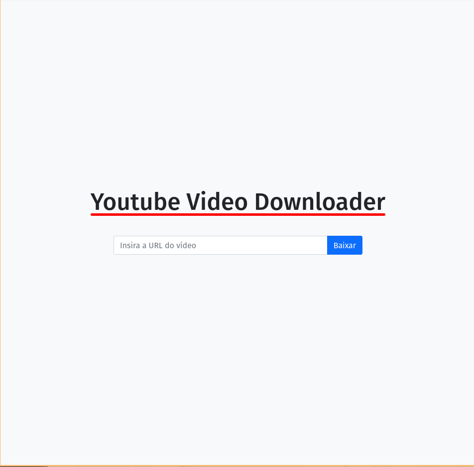
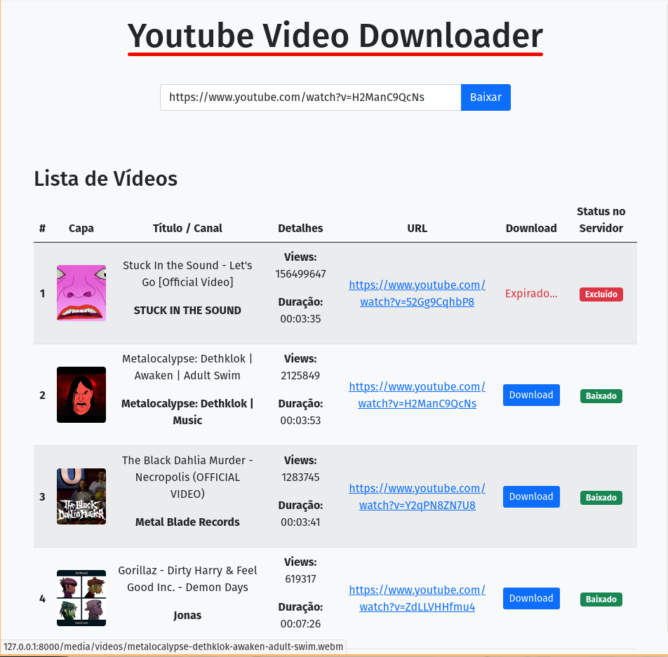

# Django YouTube Video Downloader


Este é um projeto desenvolvido para estudo e compreensão do uso da ferramenta Celery em conjunto com Django, criando uma aplicação para download de vídeos do YouTube e processamento dessas tarefas em segundo plano. O projeto utiliza Celery para gerenciar tarefas assíncronas e oferece uma interface estilizada para interagir com o sistema.

_O projeto foi criado com fins didáticos e para explorar tecnologias como Celery, Django, RabbitMQ e Docker._

## Índice 

- [Screenshots](#screenshots)
- [Funcionalidades](#funcionalidades)
- [Tecnologias](#tecnologias)
- [Lógica de Funcionamento](#lógica-de-funcionamento)
- [Views](#views)
- [Tasks](#tasks)
- [Configuração e Execução](#configuração-e-execução)
- [Observações](#observações)

## Screenshots

|  |  |
| --- | --- |

## Funcionalidades

- **Adicionação de Links do YouTube**: Permite que usuários enviem URLs de vídeos para serem processados. 
- **Processamento Assíncrono de Downloads**: Gerenciamento de downloads em segundo plano utilizando Celery e RabbitMQ. 
- **Exibição de Status**: Visualização em tempo real do status dos downloads específicos por usuário. 
- **Download de Vídeos**: Após submeter uma URL, o vídeo é baixado para o servidor e disponibilizado por link direto. O vídeo é excluído do servidor após 2 minutos. 
- **Interface**: Interface estilizada com Bootstrap para facilitar a navegação e usabilidade.

### Tecnologias

- **Django**: Framework de desenvolvimento web. 
- **Celery**: Ferramenta para execução e agendamento de tarefas assíncronas. 
- **RabbitMQ**: Broker para gerenciar filas de tarefas no Celery. 
- **Bootstrap**: Framework CSS para estilização da interface. 
- **JavaScript**: Para interatividade e comunicação assíncrona com o backend. 
- **Docker e Docker Compose**: Para containerização e gerenciamento do ambiente de desenvolvimento. 
- **yt-dlp**: Biblioteca para realizar o download de conteúdos do YouTube.
## Lógica de Funcionamento

### Views

#### `VideoListView`

Responsável por listar os vídeos associados a um endereço IP específico. Filtra vídeos processados nos últimos 5 minutos.

```
class VideoListView(views.APIView):
    """Retrieve a list of all videos."""

    def get(self, request):
        ip_address = request.META.get('REMOTE_ADDR')
        now = timezone.now()
        five_minutes_ago = now - timedelta(minutes=5)
        videos = Video.objects.filter(ip_address=ip_address, updated_at__gte=five_minutes_ago)
        serialized_response = VideoSerializer(videos, many=True).data
        return response.Response(data=serialized_response, status=status.HTTP_200_OK)
```

#### `VideoDownloadRequestView`

Gerencia as solicitações de download. Valida a URL do vídeo e inicia a tarefa assíncrona de download via Celery.

```
class VideoDownloadRequestView(views.APIView):
    """Handle video download requests."""

    def post(self, request):
        video_url = request.data.get("video_url")
        if not video_url:
            return response.Response(
                data={"error": "A URL do vídeo é obrigatória."},
                status=status.HTTP_400_BAD_REQUEST,
            )

        if not is_valid_youtube_url(video_url):
            return response.Response(
                data={"error": "A URL fornecida não é uma URL válida do YouTube."},
                status=status.HTTP_400_BAD_REQUEST,
            )

        ip_address = request.META.get("REMOTE_ADDR")

        cache_key = f"video_download_{ip_address}_{video_url}"
        cache.set(cache_key, "requested", timeout=60 * 60)  # 1 hora de timeout

        download_youtube_video.delay(video_url, ip_address=ip_address)

        return response.Response(
            data={"message": "A tarefa de download foi iniciada com sucesso!"},
            status=status.HTTP_202_ACCEPTED,
        )
```

### Tasks

#### `download_youtube_video`

Realiza o download do vídeo e salva no servidor. Após 2 minutos, exclui o arquivo para liberar espaço.

```
@shared_task
def download_youtube_video(video_url, output_path="media/videos", ip_address=None):
    if not is_valid_youtube_url(video_url):
        raise ValueError("A URL fornecida não é uma URL válida do YouTube.")

    video_info = get_video_info(video_url)
    video = Video.objects.create(
        url=video_url,
        title=video_info["title"],
        file_path="",
        duration_s=video_info["duration"],
        views=video_info["view_count"],
        upload_date=video_info["upload_date"],
        uploader=video_info["uploader"],
        thumbnail_url=video_info["thumbnail"],
        status="Pendente",
        ip_address=ip_address,
    )

    if file_path := download_video(video_url, output_path):
        video.status = "Baixado"
        video.file_path = file_path
        video.save()

        delete_video_file.apply_async((video.id,), countdown=2 * 60)
        return f"Vídeo '{video.title}' baixado com sucesso!"
```

#### `delete_video_file`

Exclui o arquivo do vídeo após um tempo definido para liberar espaço no servidor.

```
@shared_task
def delete_video_file(video_id):
    try:
        video = Video.objects.get(id=video_id)
        video.delete_file()
        return f"Arquivo do vídeo '{video.title}' excluído com sucesso."
    except Video.DoesNotExist:
        print(f"Vídeo com ID {video_id} não encontrado.")
    except Exception as e:
        print(f"Erro ao excluir o arquivo: {e}")
```

## Configuração e Execução

1. **Clonar o repositório**
    
    ```
    git clone https://github.com/usuario/django-youtube-video-downloader
    cd django-youtube-video-downloader
    ```
    
2. **Construir a imagem Docker**
    
    ```
    docker compose build
    ```
    
3. **Subir os containers**
    
    ```
    docker compose up
    ```
    
4. (Opcional)**Criar superusuário Django para acessar o painel admin**
    
    ```
    docker compose exec web python manage.py createsuperuser
    ```
    
5. **Acessar a Interface**
    
    - Aplicativo Web: `http://localhost:8000/`
        
    - Admin: `http://localhost:8000/admin/`
        
6. **Exemplo de rotas**
    
    **POST**: `/videos/download`
    
    Corpo da requisição:
    
    ```
    {
        "video_url": "https://www.youtube.com/watch?v=dQw4w9WgXcQ"
    }
    ```
    
    **GET**: `/videos/`
    
    Retorna um JSON com detalhes de todos os vídeos processados, incluindo status e links para download.
```json
    {
  "id": 122,
  "url": "https://www.youtube.com/watch?v=Y2qPN8ZN7U8",
  "title": "The Black Dahlia Murder - Necropolis (OFFICIAL VIDEO)",
  "file_path": "media/videos/the-black-dahlia-murder-necropolis-official-video.webm",
  "duration_s": 221,
  "views": 1283745,
  "upload_date": "2009-09-07",
  "thumbnail_url": "https://i.ytimg.com/vi_webp/Y2qPN8ZN7U8/maxresdefault.webp",
  "uploader": "Metal Blade Records",
  "status": "Baixado",
  "created_at": "2025-01-21T11:26:55.441754-03:00",
  "updated_at": "2025-01-21T11:27:01.612492-03:00",
  "ip_address": "172.20.0.1"
}
```

## Observações

- **Celery**: Configurado para processar tarefas assíncronas, garantindo que a experiência do usuário não seja impactada por processos demorados.
    
- **RabbitMQ**: Atua como broker para gerenciar a comunicação entre o Django e o Celery.